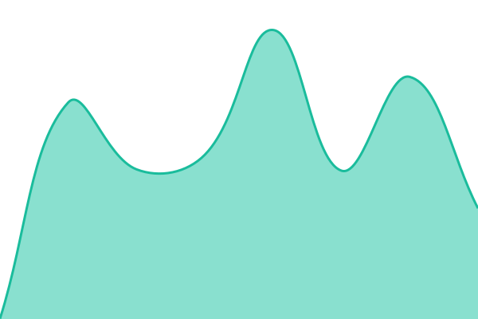

# [📈 Live Status](https://3mdeb.github.io/upptime-site): <!--live status--> **🟩 All systems operational**

This repository contains the open-source uptime monitor and status page for [3mdeb](https://3mdeb.com), powered by [Upptime](https://github.com/upptime/upptime).

With [Upptime](https://upptime.js.org), you can get your own unlimited and free uptime monitor and status page, powered entirely by a GitHub repository. We use [Issues](https://github.com/3mdeb/upptime-site/issues) as incident reports, [Actions](https://github.com/3mdeb/upptime-site/actions) as uptime monitors, and [Pages](https://3mdeb.github.io/upptime-site) for the status page.

<!--start: status pages-->
<!-- This summary is generated by Upptime (https://github.com/upptime/upptime) -->
<!-- Do not edit this manually, your changes will be overwritten -->
<!-- prettier-ignore -->
| URL | Status | History | Response Time | Uptime |
| --- | ------ | ------- | ------------- | ------ |
|  [3mdeb Website](https://3mdeb.com) | 🟩 Up | [3mdeb-website.yml](https://github.com/3mdeb/upptime-site/commits/HEAD/history/3mdeb-website.yml) | 

 1157ms
     
 | 

<a href="https://3mdeb.github.io/upptime-site/history/3mdeb-website">100.00%</a>
    

|  [3mdeb Shop](https://shop.3mdeb.com/shop) | 🟩 Up | [3mdeb-shop.yml](https://github.com/3mdeb/upptime-site/commits/HEAD/history/3mdeb-shop.yml) | 

 7639ms
     
 | 

<a href="https://3mdeb.github.io/upptime-site/history/3mdeb-shop">100.00%</a>
    

|  [3mdeb Blog](https://blog.3mdeb.com) | 🟩 Up | [3mdeb-blog.yml](https://github.com/3mdeb/upptime-site/commits/HEAD/history/3mdeb-blog.yml) | 

 1248ms
     
 | 

<a href="https://3mdeb.github.io/upptime-site/history/3mdeb-blog">100.00%</a>
    

|  [3mdeb Cloud](https://cloud.3mdeb.com) | 🟩 Up | [3mdeb-cloud.yml](https://github.com/3mdeb/upptime-site/commits/HEAD/history/3mdeb-cloud.yml) | 

 1849ms
     
 | 

<a href="https://3mdeb.github.io/upptime-site/history/3mdeb-cloud">100.00%</a>
    

|  [3mdeb Git](https://git.3mdeb.com) | 🟩 Up | [3mdeb-git.yml](https://github.com/3mdeb/upptime-site/commits/HEAD/history/3mdeb-git.yml) | 

 750ms
     
 | 

<a href="https://3mdeb.github.io/upptime-site/history/3mdeb-git">100.00%</a>
    

|  [3mdeb Matrix Server](https://matrix.3mdeb.com) | 🟩 Up | [3mdeb-matrix-server.yml](https://github.com/3mdeb/upptime-site/commits/HEAD/history/3mdeb-matrix-server.yml) | 

 640ms
     
 | 

<a href="https://3mdeb.github.io/upptime-site/history/3mdeb-matrix-server">100.00%</a>
    

|  [3mdeb Text Chat](https://chat.3mdeb.com) | 🟩 Up | [3mdeb-text-chat.yml](https://github.com/3mdeb/upptime-site/commits/HEAD/history/3mdeb-text-chat.yml) | 

 659ms
     
 | 

<a href="https://3mdeb.github.io/upptime-site/history/3mdeb-text-chat">100.00%</a>
    

|  [3mdeb Video Chat](https://meet.3mdeb.com) | 🟩 Up | [3mdeb-video-chat.yml](https://github.com/3mdeb/upptime-site/commits/HEAD/history/3mdeb-video-chat.yml) | 

 784ms
     
 | 

<a href="https://3mdeb.github.io/upptime-site/history/3mdeb-video-chat">100.00%</a>
    

|  [3mdeb Newsletter](https://listmonk.3mdeb.com) | 🟩 Up | [3mdeb-newsletter.yml](https://github.com/3mdeb/upptime-site/commits/HEAD/history/3mdeb-newsletter.yml) | 

 616ms
     
 | 

<a href="https://3mdeb.github.io/upptime-site/history/3mdeb-newsletter">100.00%</a>
    

|  [3mdeb Commentario (Blog)](https://comments.3mdeb.com) | 🟩 Up | [3mdeb-commentario-blog.yml](https://github.com/3mdeb/upptime-site/commits/HEAD/history/3mdeb-commentario-blog.yml) | 

 1193ms
     
 | 

<a href="https://3mdeb.github.io/upptime-site/history/3mdeb-commentario-blog">100.00%</a>
    

|  [3mdeb Captcha](https://cap.3mdeb.com) | 🟩 Up | [3mdeb-captcha.yml](https://github.com/3mdeb/upptime-site/commits/HEAD/history/3mdeb-captcha.yml) | 

 744ms
     
 | 

<a href="https://3mdeb.github.io/upptime-site/history/3mdeb-captcha">100.00%</a>
    

|  [Dasharo Documentation](https://docs.dasharo.com) | 🟩 Up | [dasharo-documentation.yml](https://github.com/3mdeb/upptime-site/commits/HEAD/history/dasharo-documentation.yml) | 

 440ms
     
 | 

<a href="https://3mdeb.github.io/upptime-site/history/dasharo-documentation">100.00%</a>
    

|  [Dasharo Website](https://dasharo.com) | 🟩 Up | [dasharo-website.yml](https://github.com/3mdeb/upptime-site/commits/HEAD/history/dasharo-website.yml) | 

 677ms
     
 | 

<a href="https://3mdeb.github.io/upptime-site/history/dasharo-website">100.00%</a>
    

|  [Dasharo Events](https://vpub.dasharo.com) | 🟩 Up | [dasharo-events.yml](https://github.com/3mdeb/upptime-site/commits/HEAD/history/dasharo-events.yml) | 

 2908ms
     
 | 

<a href="https://3mdeb.github.io/upptime-site/history/dasharo-events">100.00%</a>
    

|  [Dasharo Paste Service](https://paste.dasharo.com/) | 🟩 Up | [dasharo-paste-service.yml](https://github.com/3mdeb/upptime-site/commits/HEAD/history/dasharo-paste-service.yml) | 

 783ms
     
 | 

<a href="https://3mdeb.github.io/upptime-site/history/dasharo-paste-service">100.00%</a>
    

|  [Dasharo iPXE HTTP server](https://boot.dasharo.com) | 🟩 Up | [dasharo-i-pxe-http-server.yml](https://github.com/3mdeb/upptime-site/commits/HEAD/history/dasharo-i-pxe-http-server.yml) | 

 601ms
     
 | 

<a href="https://3mdeb.github.io/upptime-site/history/dasharo-i-pxe-http-server">100.00%</a>
    

|  [Yocto cache for Dasharo Tools Suite (DTS)](https://cache.dasharo.com) | 🟩 Up | [yocto-cache-for-dasharo-tools-suite-dts.yml](https://github.com/3mdeb/upptime-site/commits/HEAD/history/yocto-cache-for-dasharo-tools-suite-dts.yml) | 

 630ms
     
 | 

<a href="https://3mdeb.github.io/upptime-site/history/yocto-cache-for-dasharo-tools-suite-dts">100.00%</a>
    

|  [Fobnail Project Website](https://fobnail.3mdeb.com) | 🟩 Up | [fobnail-project-website.yml](https://github.com/3mdeb/upptime-site/commits/HEAD/history/fobnail-project-website.yml) | 

 287ms
     
 | 

<a href="https://3mdeb.github.io/upptime-site/history/fobnail-project-website">100.00%</a>
    

|  [TwPM Project Website](https://twpm.dasharo.com) | 🟩 Up | [tw-pm-project-website.yml](https://github.com/3mdeb/upptime-site/commits/HEAD/history/tw-pm-project-website.yml) | 

 285ms
     
 | 

<a href="https://3mdeb.github.io/upptime-site/history/tw-pm-project-website">100.00%</a>
    

<!--end: status pages-->

[**Visit our status website →**](https://3mdeb.github.io/upptime-site)

## 📄 License

- Powered by: [Upptime](https://github.com/upptime/upptime)
- Code: [MIT](./LICENSE) © [3mdeb](https://3mdeb.com)
- Data in the `./history` directory: [Open Database License](https://opendatacommons.org/licenses/odbl/1-0/)
