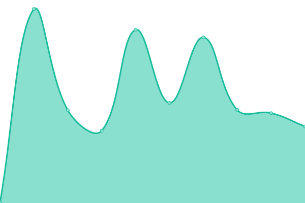

# [📈 Live Status](https://3mdeb.github.io/upptime-site): <!--live status--> **🟧 Partial outage**

This repository contains the open-source uptime monitor and status page for [3mdeb](https://3mdeb.com), powered by [Upptime](https://github.com/upptime/upptime).

With [Upptime](https://upptime.js.org), you can get your own unlimited and free uptime monitor and status page, powered entirely by a GitHub repository. We use [Issues](https://github.com/3mdeb/upptime-site/issues) as incident reports, [Actions](https://github.com/3mdeb/upptime-site/actions) as uptime monitors, and [Pages](https://3mdeb.github.io/upptime-site) for the status page.

<!--start: status pages-->
<!-- This summary is generated by Upptime (https://github.com/upptime/upptime) -->
<!-- Do not edit this manually, your changes will be overwritten -->
<!-- prettier-ignore -->
| URL | Status | History | Response Time | Uptime |
| --- | ------ | ------- | ------------- | ------ |
|  [3mdeb Website](https://3mdeb.com) | 🟩 Up | [3mdeb-website.yml](https://github.com/3mdeb/upptime-site/commits/HEAD/history/3mdeb-website.yml) | 

 1168ms
     
 | 

<a href="https://3mdeb.github.io/upptime-site/history/3mdeb-website">99.76%</a>
    

|  [3mdeb Shop](https://shop.3mdeb.com) | 🟥 Down | [3mdeb-shop.yml](https://github.com/3mdeb/upptime-site/commits/HEAD/history/3mdeb-shop.yml) | 

 3805ms
     
 | 

<a href="https://3mdeb.github.io/upptime-site/history/3mdeb-shop">0.00%</a>
    

|  [3mdeb Blog](https://blog.3mdeb.com) | 🟩 Up | [3mdeb-blog.yml](https://github.com/3mdeb/upptime-site/commits/HEAD/history/3mdeb-blog.yml) | 

 1219ms
     
 | 

<a href="https://3mdeb.github.io/upptime-site/history/3mdeb-blog">100.00%</a>
    

|  [3mdeb Cloud](https://cloud.3mdeb.com) | 🟩 Up | [3mdeb-cloud.yml](https://github.com/3mdeb/upptime-site/commits/HEAD/history/3mdeb-cloud.yml) | 

 1381ms
     
 | 

<a href="https://3mdeb.github.io/upptime-site/history/3mdeb-cloud">100.00%</a>
    

|  [3mdeb Text Chat](https://chat.3mdeb.com) | 🟩 Up | [3mdeb-text-chat.yml](https://github.com/3mdeb/upptime-site/commits/HEAD/history/3mdeb-text-chat.yml) | 

 666ms
     
 | 

<a href="https://3mdeb.github.io/upptime-site/history/3mdeb-text-chat">100.00%</a>
    

|  [3mdeb Video Chat](https://meet.3mdeb.com) | 🟩 Up | [3mdeb-video-chat.yml](https://github.com/3mdeb/upptime-site/commits/HEAD/history/3mdeb-video-chat.yml) | 

 1021ms
     
 | 

<a href="https://3mdeb.github.io/upptime-site/history/3mdeb-video-chat">100.00%</a>
    

|  [3mdeb Newsletter](https://newsletter.3mdeb.com) | 🟩 Up | [3mdeb-newsletter.yml](https://github.com/3mdeb/upptime-site/commits/HEAD/history/3mdeb-newsletter.yml) | 

 966ms
     
 | 

<a href="https://3mdeb.github.io/upptime-site/history/3mdeb-newsletter">100.00%</a>
    

|  [Dasharo Documentation](https://docs.dasharo.com) | 🟩 Up | [dasharo-documentation.yml](https://github.com/3mdeb/upptime-site/commits/HEAD/history/dasharo-documentation.yml) | 

 372ms
     
 | 

<a href="https://3mdeb.github.io/upptime-site/history/dasharo-documentation">100.00%</a>
    

|  [Dasharo Website](https://dasharo.com) | 🟩 Up | [dasharo-website.yml](https://github.com/3mdeb/upptime-site/commits/HEAD/history/dasharo-website.yml) | 

 598ms
     
 | 

<a href="https://3mdeb.github.io/upptime-site/history/dasharo-website">100.00%</a>
    

|  [Dasharo Events](https://vpub.dasharo.com) | 🟩 Up | [dasharo-events.yml](https://github.com/3mdeb/upptime-site/commits/HEAD/history/dasharo-events.yml) | 

 1298ms
     
 | 

<a href="https://3mdeb.github.io/upptime-site/history/dasharo-events">100.00%</a>
    

|  [Dasharo iPXE HTTP server](https://boot.dasharo.com) | 🟩 Up | [dasharo-i-pxe-http-server.yml](https://github.com/3mdeb/upptime-site/commits/HEAD/history/dasharo-i-pxe-http-server.yml) | 

 663ms
     
 | 

<a href="https://3mdeb.github.io/upptime-site/history/dasharo-i-pxe-http-server">100.00%</a>
    

|  [Yocto cache for Dasharo Tools Suite (DTS)](https://cache.dasharo.com) | 🟩 Up | [yocto-cache-for-dasharo-tools-suite-dts.yml](https://github.com/3mdeb/upptime-site/commits/HEAD/history/yocto-cache-for-dasharo-tools-suite-dts.yml) | 

 660ms
     
 | 

<a href="https://3mdeb.github.io/upptime-site/history/yocto-cache-for-dasharo-tools-suite-dts">100.00%</a>
    

|  [Fobnail Project Website](https://fobnail.3mdeb.com) | 🟩 Up | [fobnail-project-website.yml](https://github.com/3mdeb/upptime-site/commits/HEAD/history/fobnail-project-website.yml) | 

 293ms
     
 | 

<a href="https://3mdeb.github.io/upptime-site/history/fobnail-project-website">100.00%</a>
    

|  [TwPM Project Website](https://twpm.dasharo.com) | 🟩 Up | [tw-pm-project-website.yml](https://github.com/3mdeb/upptime-site/commits/HEAD/history/tw-pm-project-website.yml) | 

 264ms
     
 | 

<a href="https://3mdeb.github.io/upptime-site/history/tw-pm-project-website">100.00%</a>
    

<!--end: status pages-->

[**Visit our status website →**](https://3mdeb.github.io/upptime-site)

## 📄 License

- Powered by: [Upptime](https://github.com/upptime/upptime)
- Code: [MIT](./LICENSE) © [3mdeb](https://3mdeb.com)
- Data in the `./history` directory: [Open Database License](https://opendatacommons.org/licenses/odbl/1-0/)
